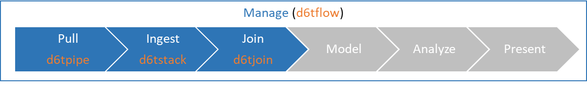

# Accelerate Data Science

## Databolt python libraries

For data scientists and data engineers, DataBolt is a collection of python-based libraries and products to reduce the time it takes to get your data ready for analysis and collaborate with others.

Majority of time in data science is spent on tedious tasks unrelated to data analysis. DataBolt simplifies those tasks so you can experience up to 10x productivity gains.

* **manage data workflows**: quickly build highly effective data science workflows
* **push/pull data**: quickly get and share data files like code
* **import data**: quickly ingest messy raw CSV and XLS files to pandas, SQL and more
* **join data**: quickly combine multiple datasets using fuzzy joins

The libraries are modularized so you can use them individually but they work well together to improve your entire data workflow. 

## [Manage data workflows](https://github.com/d6t/d6tflow)

Easily manage data workflows including complex dependencies and parameters. With d6tflow you can easily chain together complex data flows and intelligently execute them. You can quickly load input and output data for each task. It makes your workflow very clear and intuitive.

### What can it do?

* Build a data workflow made up of tasks with dependencies and parameters
* Intelligently rerun workflow after changing parameters, code or data
* Quickly load task input and output data without manual work

Learn more at [https://github.com/d6t/d6tflow](https://github.com/d6t/d6tflow)

## [Push/Pull Data](https://github.com/d6t/d6tpipe)

d6tpipe is a python library which makes it easier to exchange data. It's like git for data! But better because you can include it in your data science code.

### What can it do?

* Quickly create public and private remote file storage on AWS S3 and ftp
* Push/pull data to/from remote file storage to sync files and share with others
* Add schema information so data can be loaded quickly

Learn more at [https://github.com/d6t/d6tpipe](https://github.com/d6t/d6tpipe)

## [Ingest Data](https://github.com/d6t/d6tstack)

Quickly ingest raw files. Works for XLS, CSV, TXT which can be exported to CSV, Parquet, SQL and Pandas. d6tstack solves many performance and other problems typically encountered when ingesting raw files.

### What can it do?

* Fast pd.to_sql() for postgres and mysql
* Check and fix schema problems like added/missing/renamed columns
* Load and process messy Excel files

Learn more at [https://github.com/d6t/d6tstack](https://github.com/d6t/d6tstack)

## [Join Data](https://github.com/d6t/d6tjoin)

Easily join different datasets without writing custom code using fuzzy matches. Does similarity joins on strings, dates and numbers. For example you can quickly join similar but not identical stock tickers, addresses, names and dates without manual processing.

### What can it do?

* Identify and diagnose join problems
* Best match fuzzy joins on strings and dates
* Best match substring joins

Learn more at [https://github.com/d6t/d6tjoin](https://github.com/d6t/d6tjoin)

## [Blog](http://blog.databolt.tech)

We encourage you to join the Databolt blog to get updates and tips+tricks [http://blog.databolt.tech](http://blog.databolt.tech)

## [About](https://www.databolt.tech)

[https://www.databolt.tech](https://www.databolt.tech)

For questions or comments contact: support-at-databolt.tech
