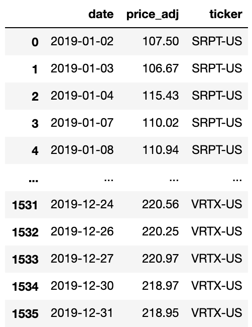
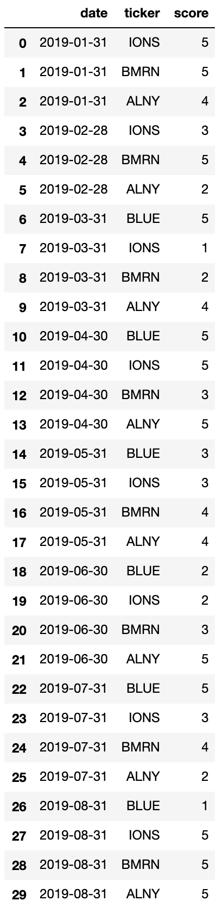
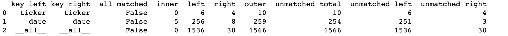
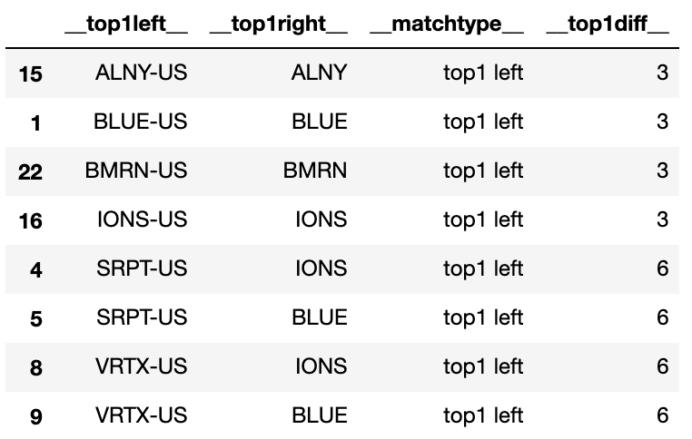
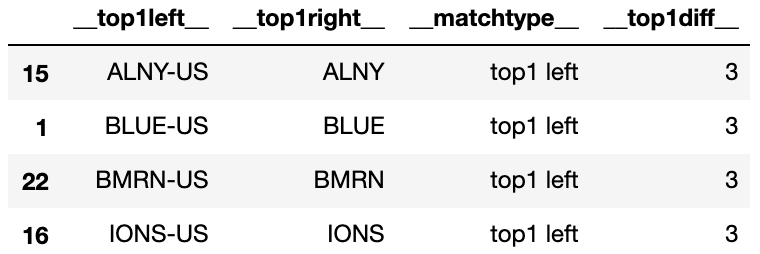
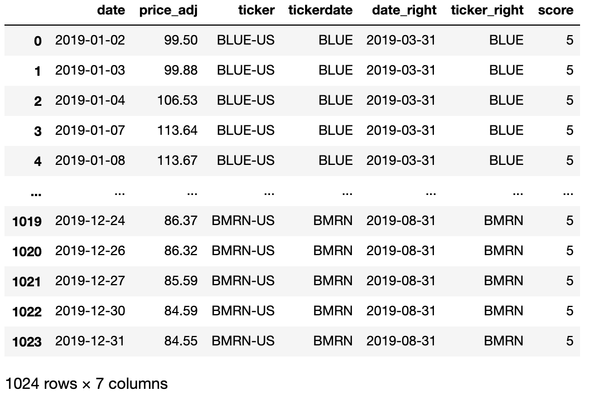
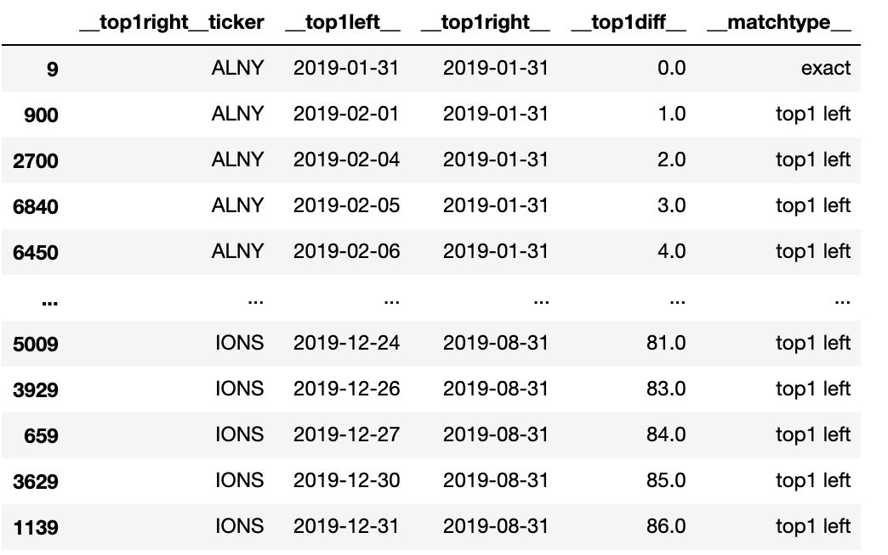
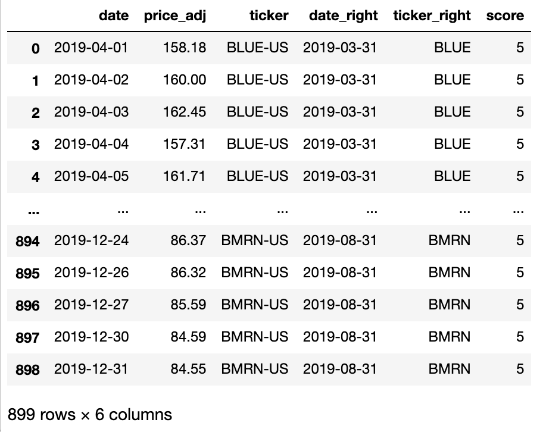

# Fuzzy joins in python with d6tjoin

## Combining different data sources is a time suck!
Combining data from different sources can be a big time suck for data scientists. [d6tjoin](https://github.com/d6t/d6tjoin) is a python library that lets you join pandas dataframes quickly and efficiently.

Coauthored with [Haijing Li](https://www.linkedin.com/in/haijing-li-7b50a11b2/), Data Analyst in Financial Services, MS Business Analytics@Columbia University.


## Example
I have made up this example to illustrate what d6tjoin is capable of.

Suppose several companies' stocks have gained my attention for a while and I have came up with a strategy to score those companies' performances in a 1-5 point scale. Backtesting on history data will help me evaluate if stock price really reflects those scores and find out how I want to trade according to those scores. 
Information I need for backtesting is contained in the following two datasets: df_price contains historical stock prices of year 2019 and df_score contains scores updated regularly by myself.






To prepare for backtesting, I need to merge "score" column to df_price. Obviously, ticker name and date should be the merge keys. But there are two problems: 1.Values in "ticker" of df_price and of df_valuation are not identical; 2.Scores were recorded on a monthly basis and I want each row in df_price to be assigned with the most recent assuming next score would not be available until next update date.


## Prejoin Analysis
One thing best about d6tjoin is that it provides easy pre join diagnostic. This is particularly useful for detecting potential data problems even if you did't intend to do fuzzy join. 
```
import d6tjoin
j = d6tjoin.Prejoin([df_price,df_score],['ticker','date'])

try:
    assert j.is_all_matched() # fails
except:
    print('assert fails!')
```

After this, we know that the two tables are not all matched on merge keys. This would be more useful when you have larger size datasets and messier string identifier that you cannot tell by a glance if the two datasets have different key values.

For our case, a more useful method is `Prejoin.match_quality()`.It summarizes the number of matched/unmatched records for each join key. In our case, no ticker name are exactly matched and few dates are matched. This is why we need d6tjoin to help with fuzzy join.
```
j.match_quality()
```



## Join with Misaligned Ids(names) and Dates
d6tjoin does best match joins on strings, dates and numbers. Its `MergeTop1()`object in `d6tjoin.top1` module is very versatile that gives you flexibility to define how you want to merge: exact or fuzzy on multiple keys using default or costumed difference functions. By default, distance of strings are calculated using Levenshtein distance.  

In our example, both 'ticker' and 'date' are misaligned in the two datasets, so we need to do fuzzy join on both.

```
result=d6tjoin.top1.MergeTop1(df_price,df_score,fuzzy_left_on=['ticker','date'],fuzzy_right_on=['ticker','date']).merge()
```
Result is stored in dictionary structure which contains two keys: `{'merged': a pandas dataframe of the merged result; 'top1': performance statistics and summary for each join key}`

Let's take a look at the result:
```
result['top1']['ticker']
result['merged']
```
The first line gives back performance summary on key 'ticker'. It shows not only matched key values on right and left but also the calculated difference scores in `_top1diff_` column. By default, each key value in the left table should be matched to one from the right table. Therefore even if "SRPT-US" and "VRTX-US" are not recorded in df_score, they still get matched to some values. We can solve this problem by setting `top_limit=3`, which will make any matching that differs larger than 3 ignored.


The second line gives back the merged dataset.


The original df_price dataset contains only 1536 rows but why after merged it becomes 5209 rows? 
Well, that's because in the original datasets we parse "date" as strings. d6tjoin use Levenshtein distance to calculate difference for strings by default and so one date from left would be matched with several dates from right. That tells you everytime dealing with date you should check its datatype first.

Change "date" datatype from string to datetime object and set `top_limit=3` for "ticker". Let's check the result again.
```
import datetime
df_price["date"]=df_price["date"].apply(lambda x: datetime.datetime.strptime(x,'%Y-%m-%d'))
df_score["date"]=df_score["date"].apply(lambda x: datetime.datetime.strptime(x,'%Y-%m-%d'))
``` 
```
result=d6tjoin.top1.MergeTop1(df_price,df_score,fuzzy_left_on=['ticker','date'],fuzzy_right_on=['ticker','date'],top_limit=[3,None]).merge()
```
```
result['top1']['ticker']
result['merged']
```





Looks good! All the tickers in left are perfectly matched and dates from left are matched to the closest from the right.

## Advanced Usage Option: Passing a Custom Difference Function
Now we have one last problem left. Remember that we want to assume scores would not be available until it was assigned. That means we want each row from df_price to be matched to a previously most recent score. But by default d6tjoin doesn't consider the order of dates but only match with the closest date either before or behind.

To tackle this problem, we need to write a custom difference function: if date from left is previous to that from right, the calculated difference should be made large enough to let the match ignored.
```
import numpy as np

def diff_customized(x,y):
    if np.busday_count(x,y)>0: #x is left_date and y is right_date,np_busday_count>0 means left_date is previous to right date
        diff_= 10000000000   #as large enough
    else:
        diff_=np.busday_count(x,y)    
    return abs(diff_)
```

Now let’s parse the custom difference function in and see result.

```
result=d6tjoin.top1.MergeTop1(df_price,df_score,fuzzy_left_on=['ticker','date'],fuzzy_right_on=['ticker','date'],fun_diff=[None,diff_customized],top_limit=[3,300]).merge()
```
```
result['top1']['date']
result['merged']
```




Now we have our final merged dataset: price data without a previously assigned score are ignored and the others are each assigned with a previously most recent score.

## Conclusion
d6tjoin provides features including:
- Pre join diagnostics to identify mismatched join keys
- Best match joins that finds most similar value of misaligned ids, names and dates
- Ability to customize difference functions, set max difference and other advanced features

Check out [d6t library](https://github.com/d6t/d6t-python). It provides solutions to common data science problems including:
- [d6tflow](https://github.com/d6t/d6tflow): build data science workflow
- [d6tjoin](https://github.com/d6t/d6tjoin): quickly fuzzy joins
- [d6tpipe](https://github.com/d6t/d6tpipe): quickly share and distribute data


